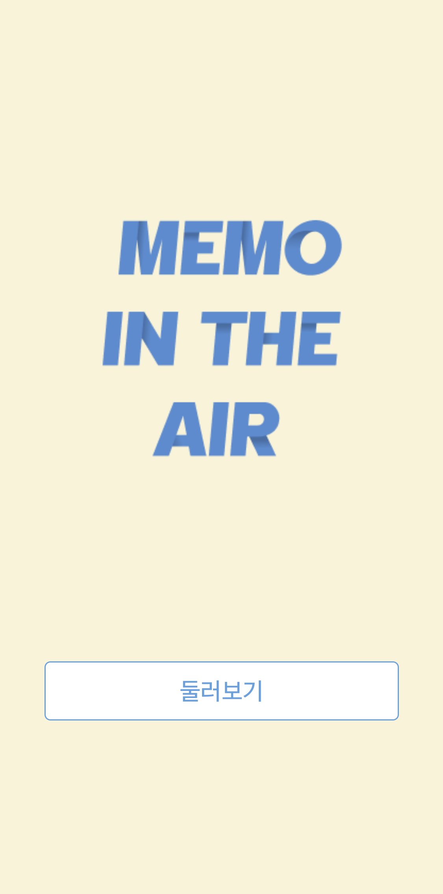
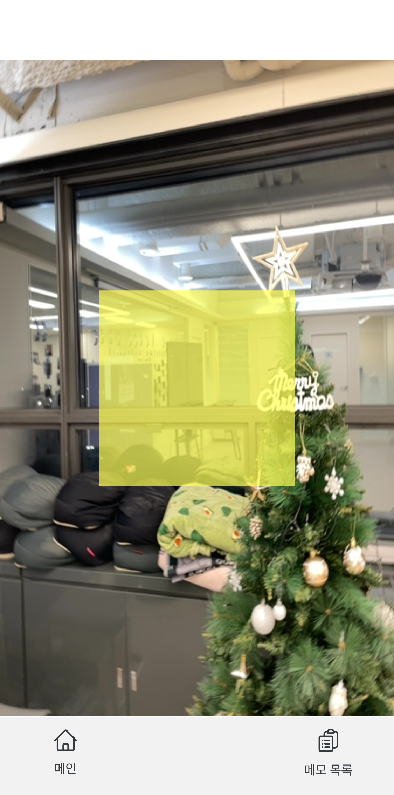
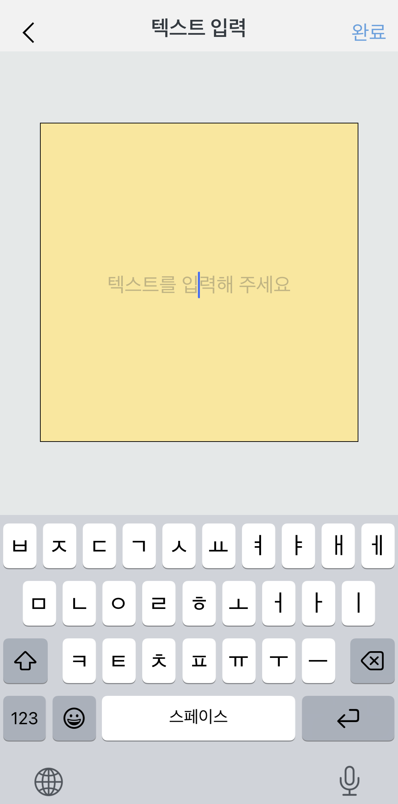
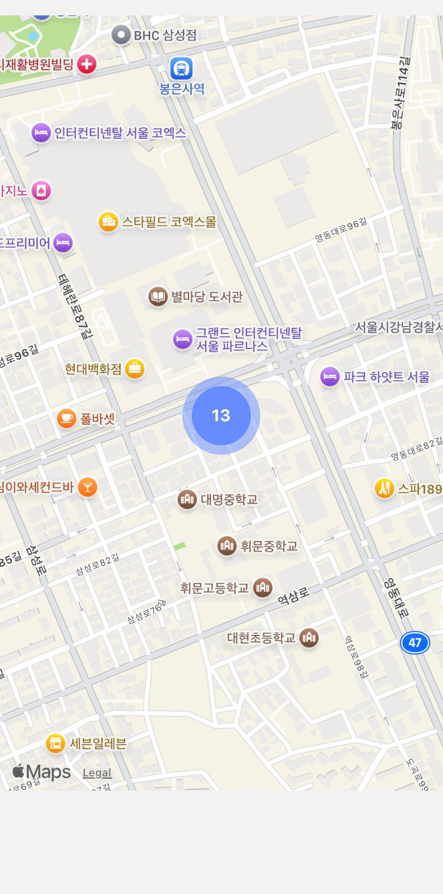
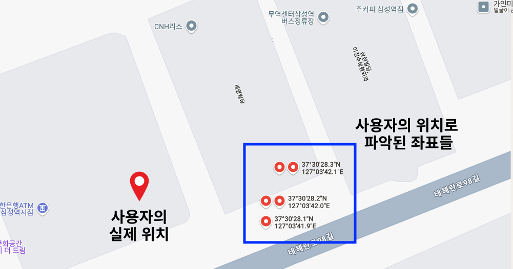
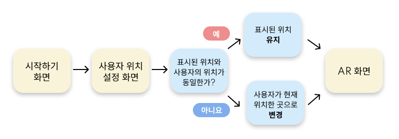

# MEMO IN THE AIR

 

  

 

  <b>증강 현실(AR) 속 원하는 공간에 메모를 기록</b>하는 React Native iOS전용 모바일 애플리케이션
   

 
 

# 목차

<!-- toc -->

- [프로젝트를 기획하게 된 동기](#%ED%94%84%EB%A1%9C%EC%A0%9D%ED%8A%B8%EB%A5%BC-%EA%B8%B0%ED%9A%8D%ED%95%98%EA%B2%8C-%EB%90%9C-%EB%8F%99%EA%B8%B0)
- [AR(증강 현실)과 VR(가상 현실)의 차이점](#ar%EC%A6%9D%EA%B0%95-%ED%98%84%EC%8B%A4%EA%B3%BC-vr%EA%B0%80%EC%83%81-%ED%98%84%EC%8B%A4%EC%9D%98-%EC%B0%A8%EC%9D%B4%EC%A0%90)
- [기술 스택](#%EA%B8%B0%EC%88%A0-%EC%8A%A4%ED%83%9D)
- [UI 미리보기](#ui-%EB%AF%B8%EB%A6%AC%EB%B3%B4%EA%B8%B0)
- [구현 기능](#%EA%B5%AC%ED%98%84-%EA%B8%B0%EB%8A%A5)
  - [1. 회원가입 하지 않고 메모 저장하기](#1-%ED%9A%8C%EC%9B%90%EA%B0%80%EC%9E%85-%ED%95%98%EC%A7%80-%EC%95%8A%EA%B3%A0-%EB%A9%94%EB%AA%A8-%EC%A0%80%EC%9E%A5%ED%95%98%EA%B8%B0)
    - [1-1. 다른 사용자와 구별할 수 있는 사용자 만의 고유한 정보 파악하기](#1-1-%EB%8B%A4%EB%A5%B8-%EC%82%AC%EC%9A%A9%EC%9E%90%EC%99%80-%EA%B5%AC%EB%B3%84%ED%95%A0-%EC%88%98-%EC%9E%88%EB%8A%94-%EC%82%AC%EC%9A%A9%EC%9E%90-%EB%A7%8C%EC%9D%98-%EA%B3%A0%EC%9C%A0%ED%95%9C-%EC%A0%95%EB%B3%B4-%ED%8C%8C%EC%95%85%ED%95%98%EA%B8%B0)
    - [1-2. 사용자의 정보를 기억하기 위한 방법 : `expo-secure-store`](#1-2-%EC%82%AC%EC%9A%A9%EC%9E%90%EC%9D%98-%EC%A0%95%EB%B3%B4%EB%A5%BC-%EA%B8%B0%EC%96%B5%ED%95%98%EA%B8%B0-%EC%9C%84%ED%95%9C-%EB%B0%A9%EB%B2%95--expo-secure-store)
  - [2. 지도를 활용하여 메모 목록 구현하기](#2-%EC%A7%80%EB%8F%84%EB%A5%BC-%ED%99%9C%EC%9A%A9%ED%95%98%EC%97%AC-%EB%A9%94%EB%AA%A8-%EB%AA%A9%EB%A1%9D-%EA%B5%AC%ED%98%84%ED%95%98%EA%B8%B0)
    - [2-1. 마커 클러스터링(marker-clustering)이란?](#2-1-%EB%A7%88%EC%BB%A4-%ED%81%B4%EB%9F%AC%EC%8A%A4%ED%84%B0%EB%A7%81marker-clustering%EC%9D%B4%EB%9E%80)
    - [2-2. 지도를 활용하여 메모 목록의 상세 정보 보여주기](#2-2-%EC%A7%80%EB%8F%84%EB%A5%BC-%ED%99%9C%EC%9A%A9%ED%95%98%EC%97%AC-%EB%A9%94%EB%AA%A8-%EB%AA%A9%EB%A1%9D%EC%9D%98-%EC%83%81%EC%84%B8-%EC%A0%95%EB%B3%B4-%EB%B3%B4%EC%97%AC%EC%A3%BC%EA%B8%B0)
- [문제 해결](#%EB%AC%B8%EC%A0%9C-%ED%95%B4%EA%B2%B0)
  - [1. AR 적용을 위한 라이브러리 : `react-viro` vs `AR.js`](#1-ar-%EC%A0%81%EC%9A%A9%EC%9D%84-%EC%9C%84%ED%95%9C-%EB%9D%BC%EC%9D%B4%EB%B8%8C%EB%9F%AC%EB%A6%AC--react-viro-vs-arjs)
  - [2. 사용자의 위치를 설정하는 화면 추가](#2-%EC%82%AC%EC%9A%A9%EC%9E%90%EC%9D%98-%EC%9C%84%EC%B9%98%EB%A5%BC-%EC%84%A4%EC%A0%95%ED%95%98%EB%8A%94-%ED%99%94%EB%A9%B4-%EC%B6%94%EA%B0%80)
    - [2-1. 동일한 장소에서 사용자의 위치가 매번 다르게 반환되는 이유](#2-1-%EB%8F%99%EC%9D%BC%ED%95%9C-%EC%9E%A5%EC%86%8C%EC%97%90%EC%84%9C-%EC%82%AC%EC%9A%A9%EC%9E%90%EC%9D%98-%EC%9C%84%EC%B9%98%EA%B0%80-%EB%A7%A4%EB%B2%88-%EB%8B%A4%EB%A5%B4%EA%B2%8C-%EB%B0%98%ED%99%98%EB%90%98%EB%8A%94-%EC%9D%B4%EC%9C%A0)
    - [2-2. 사용자가 직접 자신의 위치를 설정하도록 하여 위치 정확도를 높이자.](#2-2-%EC%82%AC%EC%9A%A9%EC%9E%90%EA%B0%80-%EC%A7%81%EC%A0%91-%EC%9E%90%EC%8B%A0%EC%9D%98-%EC%9C%84%EC%B9%98%EB%A5%BC-%EC%84%A4%EC%A0%95%ED%95%98%EB%8F%84%EB%A1%9D-%ED%95%98%EC%97%AC-%EC%9C%84%EC%B9%98-%EC%A0%95%ED%99%95%EB%8F%84%EB%A5%BC-%EB%86%92%EC%9D%B4%EC%9E%90)

<!-- tocstop -->

 

# 프로젝트 기획 동기

특정 장소와 연관된 사소한 생각이나 정보를 기록하고 싶을 때, 그 내용을 장소에 저장하는 메모 애플리케이션은 많습니다. 그러나 대부분은 시간과 텍스트 중심으로 되어있어, 특정 장소와 연결된 메모를 시각적으로 남기는 데는 한계가 있었습니다. 그래서 "특정 공간에 가상의 메모를 띄우면 어떨까?"라는 생각을 하게 되었습니다.

장소와 메모를 연결하는 새로운 경험을 제공하기 위해, AR을 활용하여 특정 공간에 가상의 메모를 기록할 수 있는 모바일 애플리케이션을 기획하게 되었습니다.

 

# AR(증강 현실)과 VR(가상 현실)의 차이점

- AR(Augmented Reality) : 증강 현실
  - 현실 배경 또는 이미지에 컴퓨터가 만든 가상의 정보를 덧띄우는 기술
- VR(Virtual Reality) : 가상 현실
  - 컴퓨터를 통해 만들어진 가상 세계를 사용자에게 제공하여 가상 세계를 현실처럼 생생히 체험할 수 있는 기술

**MEMO IN THE AIR**은 사용자의 휴대폰 카메라를 통해 특정 공간에 가상의 메모를 띄우고 확인하는 AR 애플리케이션입니다.

 

# 기술 스택

<table>
  <tr>
    <td><b>App</b></td>
    <td>     </td>
  </tr>
  <tr>
    <td><b>Web</b></td>
    <td></td>
  </tr>
</table>

 
 

# UI 미리보기

<table>
  <tr>
    <td width="25%">메인 화면</td>
    <td width="25%">사용자 위치 파악 화면</td>
    <td width="25%">AR 화면</td>
    <td width="25%">AR 화면 - 그리드</td>
  </tr>
  <tr>
    <td>
      
    </td>
    <td>
      
    </td>
    <td>
      
    </td>
    <td>
      
    </td>
  </tr>
  <tr>
    <td width="25%">메모 등록 화면</td>
    <td width="25%">메모 목록 화면</td>
    <td width="25%">메모 목록 모달</td>
    <td width="25%"></td>
  </tr>
  <tr>
    <td>
      
    </td>
    <td>
      
    </td>
    <td>
      
    </td>
    <td>
    </td>
  </tr>
</table>

 

# 구현 기능

## 1. 회원가입 하지 않고 메모 저장하기

`UUID`와 `expo-secure-store`를 활용하여 회원가입 없이도 서비스를 이용할 수 있도록 했습니다.

기획 단계에서 앱스토어에 등록된 무료 메모 앱들을 파악했을 때, 회원가입이나 로그인없이도 서비스를 제공하는 앱이 많다는 것을 파악하게 되었습니다. 해당 사항을 참고하여 누구나 자유롭게 AR 기능을 체험하고 메모를 자유롭게 등록할 수 있도록, 회원가입 없이도 사용할 수 있는 앱을 기획하게 되었습니다.

이를 위해선 다음 두 가지 조건을 충족해야 했습니다.

1. 사용자를 식별할 수 있는 고유 정보를 파악할 수 있어야 한다.
2. 앱 종료 후에도 고유 정보를 기억하여, 재실행 시에도 동일 사용자로 파악되어야 한다.

 

### 1-1. 다른 사용자와 구별할 수 있는 사용자 만의 고유한 정보 파악하기

React Native 앱에서는 디바이스의 정보를 파악할 수 있는 `expo-device` 라이브러리가 있지만, 디바이스의 고유 ID를 제공하지 않기 때문에 적합하지 않았습니다. 이에 따라, 고유성이 보장되는 `UUID 버전 4`를 사용하여 앱 실행 시 사용자별 고유 ID를 생성하는 방법을 채택하였습니다.

  
UUID 생성 코드

  

    import { v4 } from "uuid";

    export function createUUID(): string {
      return v4();
    }

  

 

### 1-2. 사용자의 정보를 기억하기 위한 방법 : `expo-secure-store`

사용자의 고유 ID는 앱 종료나 재실행시에도 유지되어야 했습니다. 기존에 저장된 ID가 없다면 신규 사용자로 인식하고 ID를 생성하며, 이미 저장된 ID가 있다면 기존 사용자의 ID를 불러와야 합니다. 이를 위해 `expo-secure-store` 라이브러리를 활용했습니다.

`expo-secure-store` 라이브러리는 데이터를 암호화하여 키-값 조합으로 디바이스에 영구적으로 저장하는 기능을 제공하므로, 앱이 업데이트되나 종료되어도 데이터를 안전하게 유지할 수 있습니다. 이러한 특성 덕분에 해당 라이브러리를 채택하게 되었습니다.

  
expo-secure-store를 통해 사용자의 ID를 앱에 저장하는 코드

  

    import * as SecureStore from "expo-secure-store";

    export async function checkUserId(): Promise<string> {
      let userId: string | null = await SecureStore.getItemAsync("userId");

      if (userId === null) {
        userId = createUUID();
        await SecureStore.setItemAsync("userId", JSON.stringify(userId));
      }

      return userId;
    }

  

 

**UUID**와 **expo-secure-store** 라이브러리를 함께 사용하여, 회원가입 없이도 사용자를 구분하고 사용자의 정보를 제공할 수 있는 구조를 구현하게 되었습니다.

 

## 2. 지도를 활용하여 메모 목록 구현하기

이 서비스는 장소 기반 메모 애플리케이션이므로, 메모를 단순히 정렬해 보여주는 대신 지도 위에 표시하는 방식이 더 직관적이라고 판단되어 지도를 사용하였습니다. 그리고 마커 클러스터링(marker-clustering)을 통해 비슷한 위치에 등록된 메모의 수를 쉽게 파악할 수 있도록 구현하였습니다.

### 2-1. 마커 클러스터링(marker-clustering)이란?

- 마커(Marker): 지도에 올라가는 핀 모양의 이미지
- 클러스터(Cluster): 여러 마커가 근접하여 표시될 때, 해당 마커들을 하나의 그룹으로 묶어서 표시하는 기능

 
마커 클러스터링이란 지도에 있는 여러 마커를 하나의 아이콘으로 통합하여 지도를 더 쉽게 이해할 수 있도록 돕는 기능입니다. 한 화면에 수많은 마커가 표시되면 성능 저하될 뿐만 아니라 마커가 겹치며 지도에 대한 사용자의 이해도가 떨어질 수 있습니다. 마커 클러스터링을 사용하면 지도가 확대했을 때는 개별 마커로 표시해 사용자가 지도상의 정보를 명확히 파악할 수 있도록 하며, 축소되었을 때는 여러 개의 마커를 하나의 클러스터로 표시하여 간결한 지도 화면을 제공할 수 있습니다.

 

  
📍 마커 클러스터링 적용 전과 후의 화면 비교

  

    <table>
      <tr width="100%">
        <th width="50%">적용 전 화면</th>
        <th width="50%">적용 후 화면</th>
      </tr>
      <tr>
        <td>
          
        </td>
        <td>
          
        </td>
      </tr>
    </table>
  

 

### 2-2. 지도를 활용하여 메모 목록의 상세 정보 보여주기

지도를 기반으로 한 메모 목록 화면에서 메모의 상세 정보를 사용자에게 더 직관적으로 제공할 방법에 대해 고민하게 되었습니다.

초기에 생각했던 방법은 대부분의 메모 애플리케이션과 유사하게 메모 내용만 표시되는 목록 화면으로 구현하는 것이었습니다. 이 방법을 생각한 이유는 사용자에게 익숙한 화면 방식을 따를 수 있기 때문이었습니다. 그러나 이 서비스는 장소 기반으로 한 애플리케이션이기 때문에, 대부분의 지도 애플리케이션의 동작 방식과 같이 사용자가 선택한 장소의 상세 정보는 지도 화면과 함께 표시되는 방법이 더 적합하다고 판단되었습니다. 따라서 지도 화면을 유지하면서 선택한 메모의 정보를 직관적으로 제공할 수 있도록 하단에 모달을 띄우는 방식을 채택하게 되었습니다.

사용자가 지도 화면에 표시된 마커 또는 클러스터를 클릭하면, 지도가 확대되며 선택한 위치가 지도의 중앙으로 이동하게 됩니다. 이 기능을 유지하기 위해 모달이 지도 화면의 절반을 넘지 않도록 구현하여 지도와 메모 목록이 함께 표시되도록 하였습니다. 확대된 지도와 함께 띄워진 모달 상단에 해당 위치의 시와 동 정보를 표시하여 사용자가 선택한 위치를 명확히 파악할 수 있도록 했습니다.

이를 통해 사용자가 선택한 위치의 메모 정보를 확인하는 동시에 그 위치와 주변 장소를 쉽게 파악할 수 있도록 구현했습니다.

 

# 문제 해결

## 1. AR 적용을 위한 라이브러리 : `react-viro` vs `AR.js`

AR.js는 웹에서 AR를 구현할 수 있는 JavaScript 웹 라이브러리로, React Native에서 WebView를 사용하여 AR을 구현했습니다.

프로젝트 초기 단계인 PoC(Proof of Concept)에서 아래와 같은 이유로 'react-viro' 라이브러리를 선택하여 구현 가능성을 검토했습니다.

1. React Native 라이브러리로, 설치 이외의 추가적인 작업이 필요하지 않다.
2. AR 환경에서 텍스트나 도형 등의 물체를 자유롭게 수정 및 변형이 가능하며, 원하는 좌표에 물체를 위치시킬 수 있는 기능을 지원한다.

`react-viro`를 사용하여 구현 가능성을 확인했기에 구현 단계에서도 해당 라이브러리를 사용했습니다. `react-viro`를 사용하여 AR 화면을 띄우고 메모 위치를 보여주는 그리드를 구현하는 데 성공했으나, 다음 단계인 메모 등록 화면 기능을 추가하며 문제가 발생했습니다. AR 화면에서 메모 등록 화면으로 이동 시 앱이 강제 종료되는 현상이 확인되었습니다.

문제를 해결하기 위해 다음과 같은 사항들을 확인했습니다.

1. Router의 문제 여부

- AR 화면 외 다른 화면들 간의 이동은 정상적으로 동작했습니다.

2. 라이브러리 GitHub 이슈 확인

- 라이브러리의 GitHub 페이지에서 동일한 이슈를 발견했으나, 해결책에 대해선 답변이 없었습니다.

3. 라이브러리 버전 다운그레이드

- 라이브러리의 버전을 낮춰 테스트를 진행했으나 동일한 문제가 발생했습니다.

`react-viro` 라이브러리 자체 문제로 판단되었고 프로젝트 마무리까지 일주일밖에 남지 않은 상황이었기 때문에 라이브러리의 문제를 해결하는 데에 시간을 쓰는 것보단 새로운 방안을 찾아야 했습니다. React Native의 다른 AR 라이브러리는 이미 PoC 단계에서 확인했었기에 웹 AR 라이브러리인 `AR.js`를 사용하는 것으로 선택했습니다.

AR 환경을 구현하기 위해선 카메라를 사용해야 하는데 WebView에서 AR 웹 애플리케이션의 HTTPS 주소를 요구한다는 것을 확인했습니다. 따라서, 프로젝트 생성 후 `AR.js`의 테스트 코드로 먼저 배포하여 동작 여부를 확인했습니다. 테스트한 결과,
WebView 내에서 AR 화면이 정상적으로 실행되며, 페이지 간의 이동 또한 정상적으로 이루어졌습니다. 이에 따라 `AR.js` 라이브러리를 사용하여 프로젝트를 진행했습니다.

 

## 2. 사용자의 위치를 설정하는 화면 추가

### 2-1. 동일한 장소에서 사용자의 위치가 매번 다르게 반환되는 이유

실내 환경에서는 GPS 신호가 건물 구조물에 의해 차단되거나 굴절되며 정확한 신호 수신이 파악되지 않아, 사용자의 위치가 매번 다르게 반환됩니다.

이 서비스는 AR 화면에서 사용자 위치를 기반으로 동작합니다. 이를 위해 AR 화면으로 진입하기 전, 사용자의 위치를 파악하는 로딩 페이지를 구현했습니다. 그러나 같은 위치에서도 매번 다른 위치 데이터가 반환되는 문제를 발견하게 되었습니다.

`expo-location` 라이브러리를 사용하여 테스트한 결과, 같은 위치에서 5번 연속 사용자의 위치를 측정한 데이터를 구글 지도에 표시했을 때, 좌표 간의 거리가 최대 <b>약 8.3m</b> 정도 차이나며, 실제 위치와 측정된 좌표 간의 거리는 최대 <b>약 22m</b> 정도 차이 나는 것을 확인했습니다.

GPS의 정확도에 관한 문제를 직접 해결할 수 없기 때문에, 기획 측면에서 해당 문제를 보완할 수 없을까 생각하게 되었습니다.

 

### 2-2. 사용자가 직접 자신의 위치를 설정하도록 하여 위치 정확도를 높이자.

API를 통해 파악한 사용자의 위치가 지도에 표시되고, 해당 위치가 정확하지 않다면 수정할 수 있도록 하는 기능을 하는 화면을 추가하여 사용자의 위치 정확도를 높혔습니다.

해당 화면에 진입하면 먼저 휴대폰으로 측정된 위치가 지도에 표시되어 있고, 표시된 위치가 현재 위치와 다르다면 사용자가 직접 위치를 선택해 수정할 수 있도록 구현했습니다. 이를 통해 위치 정보의 정확도를 높이고, 사용자에게 조금 더 정확한 AR 경험을 제공할 수 있게 되었습니다.

사용자의 위치를 설정하는 화면이 추가되며, 아래 그림과 같은 흐름을 가지게 되었습니다.

 

<table width="50%">
  <tr>
    <th>해당 화면 동작 미리보기</th>
  </tr>
  <tr>
    <td>
      
    </td>
  </tr>
</table>

 
